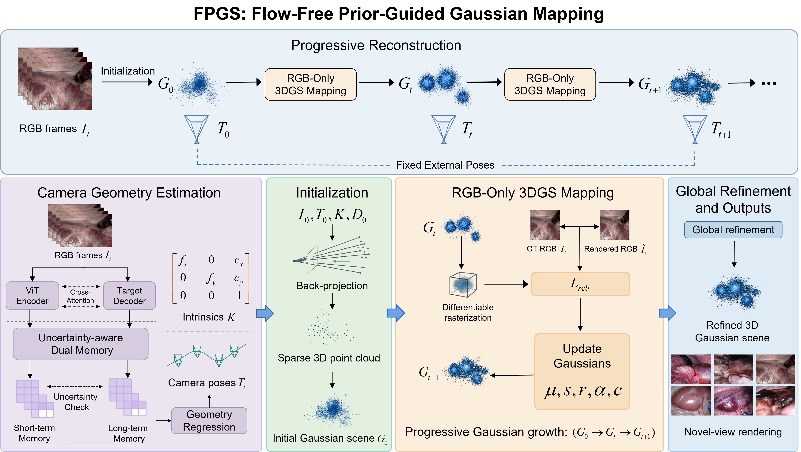
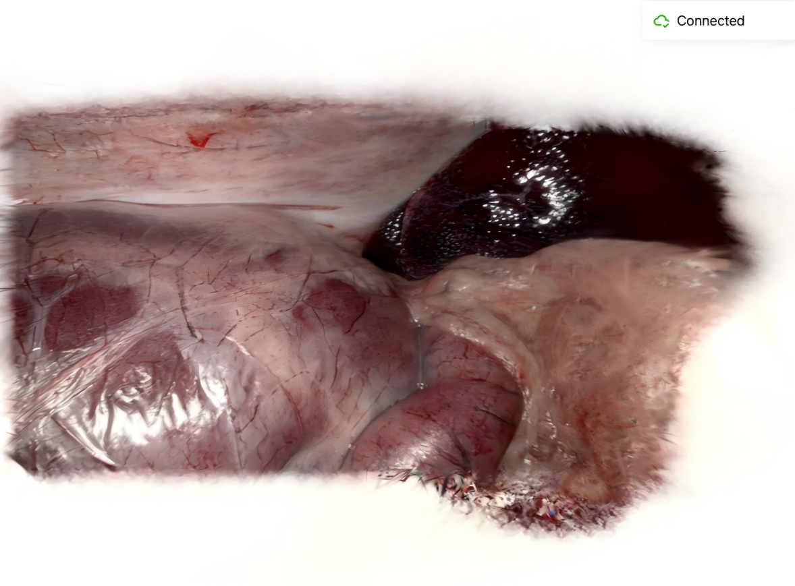
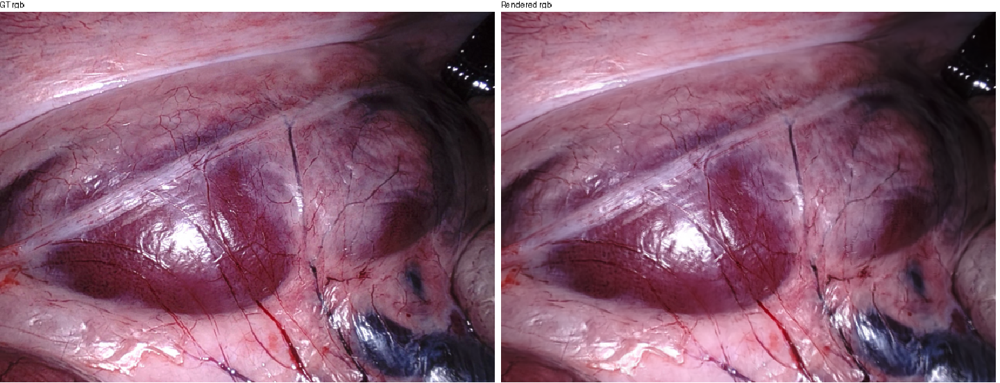
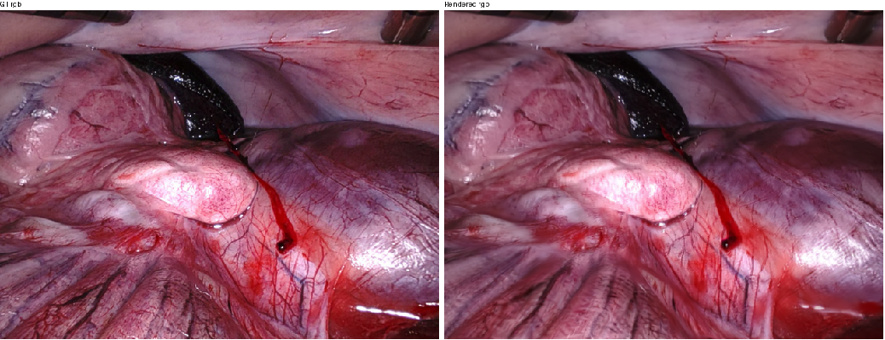
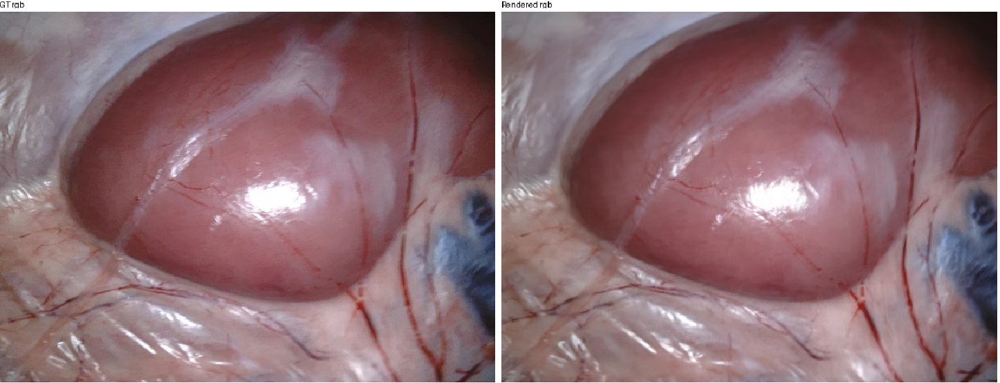

<div align="center">

# FPGS: Flow-Free Prior-Guided Gaussian Mapping

### Flow-Free 3D Gaussian Mapping for Endoscopic Surgical Scene Reconstruction


[Paper (Coming Soon)](#) |
[Project Page (Coming Soon)](#) |
[Video (Coming Soon)](#)

</div>

---

## Overview

This repository provides the implementation of **FPGS: Flow-Free Prior-Guided Gaussian Mapping** for monocular endoscopic surgical scene reconstruction.

FPGS redesigns the reconstruction backend of Free-SurGS by removing optical-flow-driven pose optimization and performing Gaussian mapping under fixed external camera geometry.

External camera poses and camera intrinsics are treated as fixed inputs. A first-frame depth prior is used only for Gaussian initialization, while subsequent mapping is optimized using RGB photometric supervision.

<p align="center">
  
</p>

---

## Method

FPGS reformulates the original joint tracking-and-mapping pipeline as a fixed-geometry Gaussian mapping framework. The reconstruction process is organized into three stages:

1. **External geometry prior construction**  
   Camera intrinsics and per-frame camera poses are obtained from an upstream geometry estimation model and converted into the coordinate convention required by the reconstruction backend. These geometric quantities are treated as fixed inputs throughout Gaussian mapping and are not refined during optimization.

2. **Prior-guided Gaussian initialization**  
   The first RGB frame, together with its depth prior and camera parameters, is used to initialize the spatial distribution, color attributes, and scale of the initial 3D Gaussians. The depth prior is used only at this stage to establish an initial scene geometry.

3. **Fixed-geometry RGB-guided Gaussian mapping**  
   After initialization, the Gaussian representation is progressively optimized using multi-view RGB photometric supervision under fixed camera geometry. The mapping stage updates Gaussian positions, appearance, opacity, and scale, while densification and pruning are used to refine scene coverage. Optical-flow supervision, projection-flow constraints, persistent depth supervision, and pose refinement are removed from the reconstruction backend.

<!--
<p align="center">
  
</p>
-->

---

## Visualization

### Reconstructed Gaussian Scene

<p align="center">
  
</p>

<p align="center">
  Reconstructed Gaussian scene under fixed external camera geometry.
</p>

### Reconstruction Results

<p align="center">
  
  
  
</p>

### Gaussian Mapping Progress

The following video visualizes the reconstructed Gaussian representation at different optimization stages.

<!--
VIDEO_LINK_HERE
-->

---

## Installation

The implementation is based on Python and PyTorch.

```bash
git clone https://github.com/jinlin04/FPGS.git
cd FPGS

conda create -n fpgs python=3.10
conda activate fpgs

pip install -r requirements.txt
```
