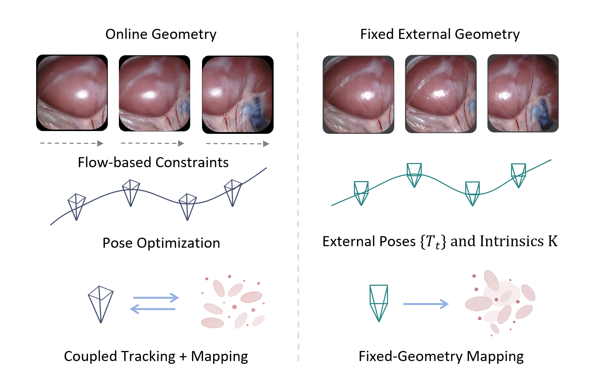
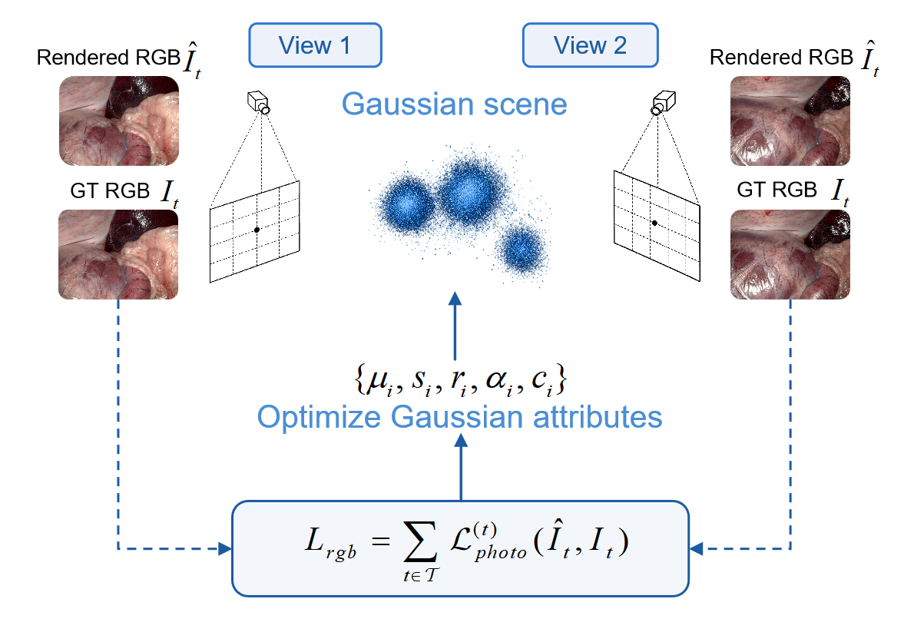
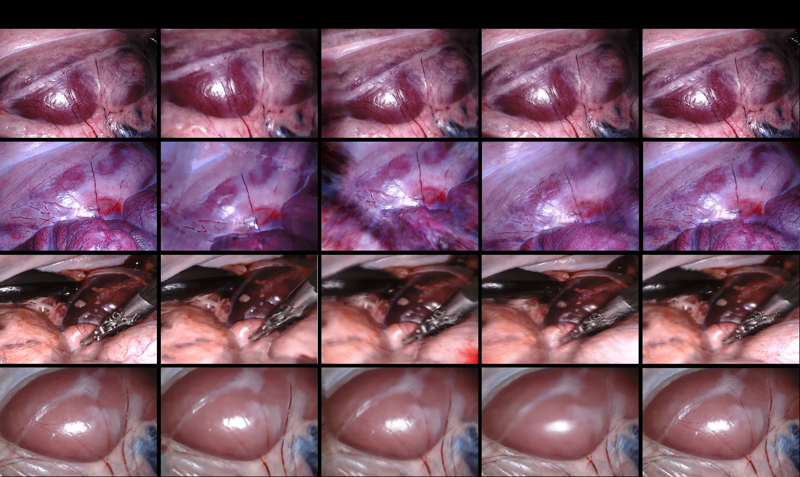
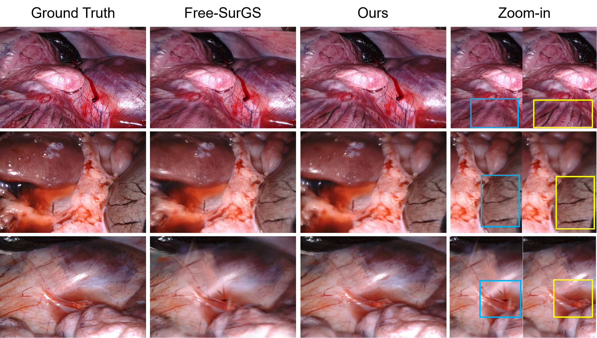
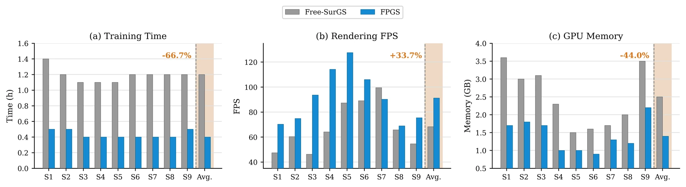

FPGS: Flow-Free Prior-Guided 3D Gaussian Mapping for Endoscopic Surgical Scene Reconstruction

Official implementation of FPGS, a flow-free fixed-geometry Gaussian mapping framework for endoscopic surgical scene reconstruction.

Overview

Recent surgical 3D Gaussian Splatting methods often couple camera tracking and Gaussian mapping into a unified optimization pipeline.

FPGS reformulates this process as a fixed-geometry Gaussian mapping framework. Camera poses and intrinsics are provided by an upstream geometry module and treated as fixed inputs. A first-frame depth prior is used only for Gaussian initialization, while subsequent reconstruction is performed using RGB-only Gaussian optimization.

  

Highlights
Flow-free Gaussian mapping under fixed external camera geometry.
Decoupled camera tracking from Gaussian scene optimization.
First-frame depth prior used only for Gaussian initialization.
RGB-only optimization during subsequent reconstruction.
Problem Setting

  

Existing surgical 3D Gaussian reconstruction approaches typically integrate camera tracking and scene optimization into a coupled framework.

FPGS investigates whether flow-driven online pose optimization remains necessary when stable external camera geometry is available.

Method Overview

  

FPGS consists of three main stages:

1. External Camera Geometry

Camera poses and intrinsics are obtained from an upstream geometry module and treated as fixed inputs. They are not optimized during Gaussian reconstruction.

2. First-frame Gaussian Initialization

The first-frame RGB image and depth prior are used with fixed camera parameters to initialize Gaussian primitives.

3. RGB-only Gaussian Mapping

After initialization, Gaussian parameters are optimized using RGB photometric supervision while keeping camera geometry fixed.

Fixed-Geometry RGB-only Gaussian Mapping

  

Under fixed camera geometry, FPGS updates only Gaussian attributes, including position, scale, rotation, opacity, and appearance.

Camera tracking, optical-flow constraints, and persistent depth supervision are removed from the reconstruction loop.

Experimental Results
Reconstruction Quality

  

Comparison with Free-SurGS

  

Efficiency

  

Visualization

  

Demo Video

A visualization demo of the reconstructed Gaussian scene is provided below.

 <video controls width="90%"> <source src="assets/demo.mp4" type="video/mp4"> </video> 

Installation

Clone this repository:

git clone https://github.com/jinlin04/FPGS.git

cd FPGS
Requirements

The implementation is tested with:

Python 3.10
PyTorch 2.x
CUDA 11.x / 12.x
NVIDIA GPU
Dataset Preparation

Experiments are conducted on the SCARED dataset.

Required inputs include:

RGB frames
Camera intrinsics
External camera poses
First-frame depth prior
Training

Example:

python train.py \
    --config configs/scared.yaml

During reconstruction:

Camera poses remain fixed.
Tracking optimization is disabled.
Gaussian parameters are optimized using RGB photometric loss.
Evaluation

Reconstruction quality is evaluated using:

PSNR
SSIM
LPIPS

Efficiency is measured by:

Training time
Rendering FPS
Peak GPU memory
Citation

If you find this work useful, please cite:

@article{fpgs2026,
  title={FPGS: Flow-Free Prior-Guided 3D Gaussian Mapping for Endoscopic Surgical Scene Reconstruction},
  author={},
  journal={IEEE Transactions on Medical Imaging},
  year={2026}
}
Acknowledgement

This project is built upon 3D Gaussian Splatting and the open-source Free-SurGS framework.
