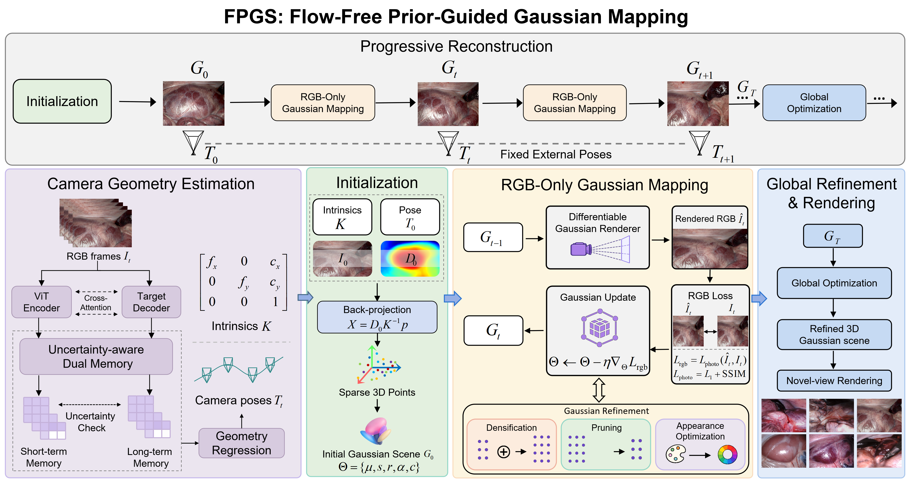
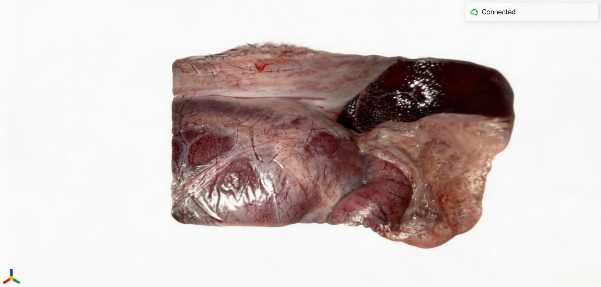

# FPGS: Flow-Free Prior-Guided 3D Gaussian Mapping for Endoscopic Surgical Scene Reconstruction


Official implementation of FPGS, a flow-free fixed-geometry Gaussian mapping framework for endoscopic surgical scene reconstruction.


## Overview


FPGS reformulates surgical 3D Gaussian Splatting reconstruction as a fixed-geometry Gaussian mapping framework.

Unlike joint tracking-and-mapping pipelines, FPGS treats external camera geometry as fixed inputs. A first-frame depth prior is only used for Gaussian initialization, while subsequent reconstruction is performed using RGB-only Gaussian optimization.


<p align="center">

</p>


## Installation


Our code is tested on:

- Ubuntu 22.04
- Python 3.10
- PyTorch 2.x
- CUDA 11.x / 12.x


Create the environment and install dependencies:


```bash
conda create -n fpgs python=3.10

conda activate fpgs

pip install -r requirements.txt
```


## Dataset


We evaluate FPGS on the SCARED dataset.


The required data structure is:


```text
dataset/
│
├── input/
│   └── RGB frames
│
├── intrinsics/
│   └── K.txt
│
├── poses/
│   └── camera poses
│
└── depth/
    └── first-frame depth prior
```


Camera poses and intrinsics are provided by an upstream geometry module and treated as fixed inputs during reconstruction.


## Training


To train FPGS, please use:


```bash
python train.py \
    -s <path_to_dataset> \
    --model_path <path_to_output> \
    --visualize True \
    --port 8039 \
    --log True
```


After training, the checkpoints and rendered results will be saved in the specified output directory.


## Evaluation


To evaluate a trained model:


```bash
python train.py \
    -s <path_to_dataset> \
    --model_path <path_to_output> \
    --test True \
    --start_checkpoint <path_to_checkpoint>
```


The reconstruction quality is evaluated using:

- PSNR ↑
- SSIM ↑
- LPIPS ↓


The efficiency is evaluated using:

- Rendering FPS
- Training time
- GPU memory consumption


## Visualization


The reconstructed 3D Gaussian scene can be visualized using the provided visualization tools.


<p align="center">

</p>


Demo video:


<p align="center">
<video width="90%" controls>
<source src="assets/demo.mp4" type="video/mp4">
</video>
</p>


## Acknowledgement


This project is based on 3D Gaussian Splatting and Free-SurGS.

We thank the authors for their open-source contributions.
